# 💫 Credit to TS Bedrock
- **Core** → [haniker-dev/bedrock-ts-core](https://github.com/haniker-dev/bedrock-ts-core)  
- **API** → [haniker-dev/bedrock-ts-api](https://github.com/haniker-dev/bedrock-ts-api)  
- **Web** → [haniker-dev/bedrock-ts-web](https://github.com/haniker-dev/bedrock-ts-web)

# 💫 Core - Api - Web flow

```mermaid
---
config:
  theme: redux
  look: neo
  layout: dagre
---
flowchart TD
subgraph CORE["CORE"]
    CoreType["🧩 Core Type"]
    AppType["📦 App Type"]
    Contract["📡 API Contract"]
    AllCode["💯 CODE"]
end
subgraph API["API"]
    ApiType["📁 Database/Server Type"]
    DB["🗄️ DB"]
    Handler["🔧 Handler"]
end

subgraph WEB["WEB"]
    WebType["🎨 View/State Type"]
    Fetch["🌐 Call API"]
    Action["🎯 Action"]
    State["🧠 State"]
    View["🪟 View"]
    User["🙋 User"]
end

%% Core types
CoreType ---> | used by | AllCode
AppType ---> | used by | AllCode

%% Contract life circle
Fetch ---> | use | Contract ---> | call | Handler
Handler ---> | use | Contract ---> | response | Fetch

%% Handler life circle
Handler ---> | call | DB ---> | return | ApiType
ApiType ---> | tranform | AppType ---> | forming | Contract

%% Fetch life circle
Action ---> | call | Fetch ---> | return | Action

%% Web render life circle
User ---> | trigger | Action ---> | change | State
State --> | used | WebType ---> | render | View ---> | show | User

linkStyle 2 stroke:#2962FF
linkStyle 3 stroke:#2962FF
linkStyle 4 stroke:#FF0000
linkStyle 5 stroke:#FF0000
linkStyle 10 stroke:#2962FF
linkStyle 11 stroke:#FF0000
```


# 💫 The motivation comes from **Functional Programming (FP)** and **Type-Driven Development (TDD)**.

## 🧪 What is Type-Driven Development (TyDD), and How Does it Help?

> ⚠️ This section refers to **Type-Driven Development**, not Test-Driven Development.

Type-Driven Development is a type-first design approach where we define the **types before the implementation**. It treats the type system as the first line of defense against bugs—shifting correctness from runtime to compile time.

Instead of writing tests to confirm what the code does, we **encode correctness directly into the types**, making invalid states unrepresentable.

### 🔑 Core Ideas

- **Start with types**: Define the domain first using `type`, `union`, and structured data—so that the shape of the problem is encoded in the type system.
- **Use ADTs (algebraic data types)**: Represent state and behavior explicitly using types like `Maybe`, `Result`, `RemoteData`, and `Opaque`. These make edge cases and failures impossible to ignore.
- **Parse at the boundaries**: Convert all external data (e.g., from forms, APIs, files) into trusted domain types before using them. This ensures internal logic never operates on unknown or invalid data.
- **Let the compiler guide you**: Type errors become your to-do list—showing exactly where logic is incomplete or unsafe during development and refactoring.
- **Types as documentation**: Function signatures act as clear, enforceable contracts—for both implementers and reviewers—reducing ambiguity and miscommunication.

### ✅ Benefits

- **Types describe business logic**  
Types don’t just shape data—they express the **intent** and rules of your domain, making your code easier to reason about.  

_Example: `type Email = string & { readonly brand: unique symbol }` makes it clear this is not just any string—it must be validated as an email. This approach is even better with a Generic Opaque Type Opaque<string, typeof emailUniqueSymbol>_

---

- **Function contracts become clear**  
Typed function signatures clearly communicate expectations and outcomes—both to the implementer and future reviewers.  

_Example: `function login(email: Email, password: Password): Result<AuthError, Session>` makes the success and failure paths explicit—the caller is required to handle both, leading to clearer, safer control flow._

---

- **Types evolve with requirements**  
As business needs change, the type system helps **track and adapt** those changes across the entire codebase.  

_Example: A common design might add `isSuspended: boolean` to `User`, but this only tells us whether the user is suspended or not—nothing can be extended further in the future. Evolving this to a richer model (using `union` type) like `suspensionStatus: { _t: 'None' } | { _t: 'Suspended'; reason: string } | { _t: 'InReview'; reviewerId: UserId }` Requirements can be extended._

---

- **Edge cases are modeled explicitly**  
Instead of being forgotten or handled implicitly, unusual or error states are **designed into** the system from the start.  

_Example: Using `RemoteData<Error, Data>` instead of a mix of `isLoading: boolean`, `isError: boolean`, and `isSuccess: boolean` prevents impossible UI states like “loading: true, isError: true, isSuccess: true” by modeling them as mutually exclusive using `union` types._

---

- **Immediate feedback loop**  
Type errors are surfaced **at development time**, enabling faster iteration without waiting for runtime or test failures.  

_Example: When adding currency to `Product`, instead of just adding `currency: 'USD' | 'EUR'`, we replace `price: number` with `pricing: { amount: number; currency: 'USD' | 'EUR' }`. This forces the compiler to flag every usage of `price`, giving us a tight feedback loop to safely update the entire codebase._

---

- **Refactor with confidence**  
Type safety ensures that structural changes are **safe to apply**—if it compiles, it likely works.  

_Example: Suppose `User` originally had `phone: Phone`, but we never decode it in the API response. Later, business rules change and require every user to have multiple phones but at least one phone number—so we want to refactor to `phones: NonEmptyArray<Phone>`. But because the original data shape was never trusted, we can't safely make that change. If we had enforced decoding upfront, the compiler would now let us evolve with confidence._

---

- **Parse, don’t validate**  
On the frontend, each form field should act as a parser—not just a string with a validation flag. Instead of validating manually with `boolean` checks, we model each field as a structured value that either contains an error or a usable result.

_Example: Instead of `email: string`, we use `email: Field<EmailError, Email>`. Traditional validation returns a `boolean`, which tells us whether something is valid—but gives us no usable data. Parsing returns a `Result<EmailError, Email>`, which either provides an error to display or a typed value we can safely pass upstream._

---

- **Better developer experience**  
Type-Driven Development improves how developers write, review, and collaborate around code. Types encode the business rules directly—so developers don’t have to reverse-engineer intent from implementation.

_Example: `function placeOrder(cart: NonEmptyArray<Item>, user: AuthenticatedUser): Result<OutOfStock | PaymentDeclined, OrderConfirmation>`_
_- From the writer’s perspective, the function signature makes it clear what needs to be handled: only authenticated users can place orders, carts must not be empty, and the function must account for both out-of-stock and payment failure scenarios._
_- From the reviewer’s perspective, the signature communicates the full contract: what’s required, what can go wrong, and what success looks like—without reading the implementation. Review becomes focused on logic and correctness, not guesswork._

---

- **Higher trust in the system**  
With logic and correctness encoded in the type system, your codebase becomes **self-validating and more resilient** over time.  

_Example: When onboarding a new developer, they can confidently work with `User`, `Session`, or `Order` types without reading every implementation detail—because the domain logic is captured in the type structure itself. This builds trust across the team: if the types align, the code aligns._

### 🤝 Relationship with Testing

Type-Driven Development doesn’t eliminate tests—it **shifts their focus**:

- **Types** validate structure and logic paths.
- **Tests** focus on runtime behaviors, edge cases, and external I/O (APIs, DB, file systems).

This approach is particularly effective when combined with Functional Programming, which we’ll explore in the next section.

### ✅ Example
```ts
type FormState =
  | { _t: "Idle" }
  | { _t: "Submitting" }
  | { _t: "Success"; data: string }
  | { _t: "Error"; error: Error }

function getMessage(state: FormState): string {
  switch (state.tag) {
    case "Idle":
      return "Fill out the form.";
    case "Submitting":
      return "Submitting...";
    case "Success":
      return `Success with data: ${state.data}`;
    case "Error":
      return `Error: ${state.error.message}`;
    // ❌ No default case needed
  }
}
// ✅ No runtime test is needed to check that "Idle", "Submitting", "Success", and "Error" are all covered.
// ✅ If a new case is added (e.g. { _t: "Cancelled" }), the compiler will force you to handle it.
// ✅ This reduces the need for fragile, repetitive tests and shifts that responsibility to the type system.

type USAddress = {
  country: "US"
  state: string // Required for US addresses
  zip: string
}

type InternationalAddress = {
  country: Exclude<string, "US">
  zip: string
}

type Address = USAddress | InternationalAddress

function formatAddress(address: Address): string {
  return address.country === "US"
    ? `${address.state}, ${address.zip}, USA`
    : `${address.zip}, ${address.country}`
}
// ✅ No need to write a test for “What if US address has no state?” — it's impossible to construct.
// ✅ No need to test invalid cases like { country: 'US' } with missing state — won't compile.
// ✅ You encode the business rule at the type level, not in if-statements or validations.
```

## 🧠 What is Functional Programming (FP), and Why Does it Work Well with TyDD?

FP is a paradigm that emphasizes **predictable behavior**, **explicit state**, and **compositional logic**. It encourages writing small, pure functions that are easy to reason about and free from hidden side effects.

**FP and TyDD reinforce each other**: FP ensures that data and behavior are predictable, while TyDD enforces those guarantees at compile time. Together, they create powerful feedback loops that drive confidence, clarity, and long-term maintainability.

### 🔧 Core FP Principles

- **Pure functions**: A function’s output depends only on its input. No hidden state or side effects.
- **Immutability**: Values are never mutated—new values are derived from old ones.
- **Algebraic Data Types (ADTs)**: Types like `Maybe`, `Result`, and tagged unions help represent possible states and make edge cases explicit.
- **Composition**: Small functions are combined into larger behavior through composition, reducing complexity and duplication.
- **First-class types**: Data modeling and function signatures reflect domain logic directly—enabling strong compiler guarantees.

### 🤝 Why FP Fits TyDD Perfectly

- **Shared focus on types**: Both FP and TyDD treat types as first-class citizens, using them to encode business rules and prevent invalid states by design.
- **Explicit control flow**: FP uses ADTs like `Result` and `Maybe` to make success/failure paths unmissable—exactly what TyDD needs to shift correctness to compile time.
- **Composable logic**: TyDD thrives when logic is isolated and predictable. FP encourages composition of pure, focused functions that are easy to reason about and test.
- **No hidden behavior**: FP discourages mutation and side effects, making type-driven guarantees more trustworthy and reliable.
- **Type-safe boundaries**: FP’s emphasis on keeping effects and I/O at the edge reinforces the TyDD pattern of “parse first, trust later.”

### ✅ Example
```ts
// Core types
type Result<E, A> = { _t: 'Ok'; value: A } | { _t: 'Err'; error: E };

const Result = {
  ok: <A>(value: A): Result<never, A> => ({ _t: 'Ok', value }),
  err: <E>(error: E): Result<E, never> => ({ _t: 'Err', error }),
};

type Task<E, A> = Promise<Result<E, A>>;

type Opaque<T> = T; // Should be properly defined in the real code, but not for this example

type PositiveInt = Opaque<number>;

// App types

type UserID = PositiveInt;
type Email = Opaque<string>;
type Password = Opaque<string>;
type JWTToken = Opaque<string>;

type SignupParams = { email: string; password: string };
type ParsedParams = { email: Email; passwordHash: Password };
type User = { id: UserID; email: Email };
type UserWithJWT = User & { token: JWTToken };

type ParamsParserError = { _t: 'ParamsParserError'; message: string };
type EmailError = { _t: 'EmailTakenError' };
type DbError = { _t: 'DbError'; reason: string };
type JWTError = { _t: 'JWTError'; reason: string };
type MailingError = { _t: 'MailingError'; reason: string };

type SignupError = ParamsParserError | EmailError | DbError | JWTError | MailingError;

// App logics
function parseSignupInput(params: SignupParams): Result<ParamsParserError, ParsedParams> {
  if (!params.email.includes('@')) {
    return Result.err({ _t: 'ParamsParserError', message: 'Invalid email' });
  }
  return Result.ok({
    email: params.email,
    passwordHash: 'hashed-' + params.password,
  });
}

async function checkEmailUnique(params: ParsedParams): Task<EmailError, ParsedParams> {
  return params.email === 'taken@example.com'
    ? Result.err({ _t: 'EmailTakenError', email: params.email })
    : Result.ok(params);
}

async function saveUser(params: ParsedParams): Task<DbError, User> {
  return Result.ok({ id: 123, email: params.email });
}

function generateJWT(user: User): Result<JWTError, UserWithJWT> {
  return Result.ok({ ...user, token: 'jwt-token' });
}

async function sendWelcomeEmail(user: User): Task<MailingError, User> {
  return Result.ok(user);
}

// App handlers
async function signupEmail(params: SignupParams): Task<SignupError, UserWithJWT> {
  const parsed = parseSignupInput(params);
  if (parsed._t === 'Err') return parsed;

  const unique = await checkEmailUnique(parsed.value);
  if (unique._t === 'Err') return unique;

  const user = await saveUser(unique.value);
  if (user._t === 'Err') return user;

  const [userWithJWT, _] = await Promise.all([generateJWT(user.value), sendWelcomeEmail(user.value)]);

  return userWithJWT;
}
```
### 🎓 Slide Summary: What This Signup Example Shows
#### ✅ `Result<E, A>` = Success or Failure by Design
```ts
type Result<E, A> = { _t: "Ok"; value: A } | { _t: "Err"; error: E }
```
-   No null/undefined
-   No surprises
    
👉 Failures are **typed and expected**

----------

#### ✅ `Task<E, A>` = Async with Structural Guarantees
```ts
type Task<E, A> = Promise<Result<E, A>>
```
-   Forces error handling
-   Composes with async    
-   Makes `Promise` safe

👉 Every await includes an outcome you must handle

----------

#### ✅ Opaque Types = Trust by the Type System
```ts
// This is one of Opaque version:
export type Opaque<T, K extends symbol, Unwrapped = T> = {
  [key in K]: T
} & {
  readonly unwrap: () => Unwrapped
  readonly toJSON: () => JSONValue
}
type Email = Opaque<string, typeof unique symbol>
type JWTToken = Opaque<string, typeof unique symbol>

export function createEmail(rawEmail: String): Result<EmailError, Email>
export async function createJWTToken(): Task<JWTError, JWTToken>
```
-   Enforces developer to ALWAYS validate Email or ONLY create JWTToken from one place
-   An Opaque type can't be changed by another module/file, it only can be created/changed at one place
-   Domain modeling at compile time

👉 "If it's not validated, it's not an `Email`"

----------

#### ✅ Small Pure Functions = Predictable Building Blocks
```ts
parseSignupInput → checkEmailUnique → saveUser → generateJWT → sendWelcomeEmail
```
-   Reusable
-   Independently testable
-   Explicit input/output types

👉 No state. No mutation. No hidden behavior.

----------

#### ✅ Flow is Linear, Typed, and Type-Safe
```ts
async function signupEmail(...) {
  const parsed = parseSignupInput(...)
  if (parsed._t === "Err") return parsed
  ...
}
```
-   No branching hell
-   No `if (this && that && maybe)` madness
-   Early return on failure

👉 **Type-safe control flow** without ceremony

## 🚀 How Do We Apply This in Real-World Projects?

Applying Type-Driven Development and Functional Programming effectively means enforcing safety and consistency through tooling and team discipline.

Here are the 9 most important enablers:

----------

### 1. ✅ Use `tsc` Strict Mode
-   Must enable `strict`, `strictNullChecks`, `noUncheckedIndexedAccess`, `noImplicitAny`
-   `tsc --noEmit` should run in CI and ideally in pre-commit
-   Type errors should be treated as **bugs**, not “won’t fix”

----------

### 2. 🚫 Ban `any`, `is`, `as`, and `!`
-   These escape hatches disable type safety
-   Use decoders, opaque types, and Result/Maybe instead
-   If you must assert, isolate it to boundary parsing and document clearly

----------

### 3. 📏 Enforce Style with ESLint + Prettier

-   Use `@typescript-eslint` with strict rules
-   Add `eslint-plugin-functional` to enforce immutability and purity
-   Format all code automatically with Prettier to eliminate style noise

----------

### 4. 🧠 Use Opaque Types for Domain Data

-   Wrap primitives like `string`, `number`, etc., in branded types:
    ```ts
    type Email = Opaque<string, 'Email'>
    type UserID = Opaque<number, 'UserID'>
    
    ```
-   Ensures no raw values are passed without validation
-   Makes types more descriptive and misuse impossible

----------

### 5. ⛔ Never Return Raw Promises

-   Don’t use `Promise<T>` in business logic
-   Use `type Task<E, A> = Promise<Result<E, A>>` instead
-   Every async function (that can fail) must return a `Result` so failures are handled structurally

----------

### 6. 🧪 Parse Before You Trust (Decoders Everywhere)

-   Parse at all data boundaries, eg. form data from user, API response from server, URL params from browser, Env from server, etc.
-   Use `decoders`, `zod` or a custom parser
-   Never operate on unknown and unvalidated input

----------

### 7. 🎯 Model Failures and Maybe as Types

-   No more `null`, `undefined`, or `boolean isError`
-   Use:
    -   `Maybe<T>` instead of `T | null`
    -   `Result<E, A>` instead of try/catch
    -   `RemoteData<E, A>` for loading/idle/error/success

----------

### 8. 🔁 Keep Effects at the Edge

-   Code that touches the outside world (fetch, DB, file system, etc.) should be isolated.
-   Your core logic should stay **pure**: no side effects, just input → output.
-   This makes your core logic easy to test and reuse.

----------

### 9. 🧼 Pure Functions Only in Domain Logic

-   No `class`, no `new`, no mutation
-   Domain logic = pure functions + ADTs
-   Business logic should be:
    -   Composable
    -   Referentially transparent
    -   Easy to test and refactor
